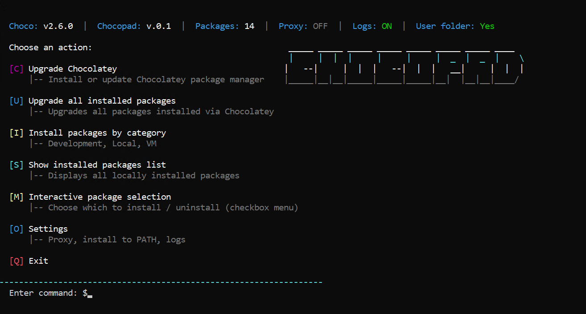
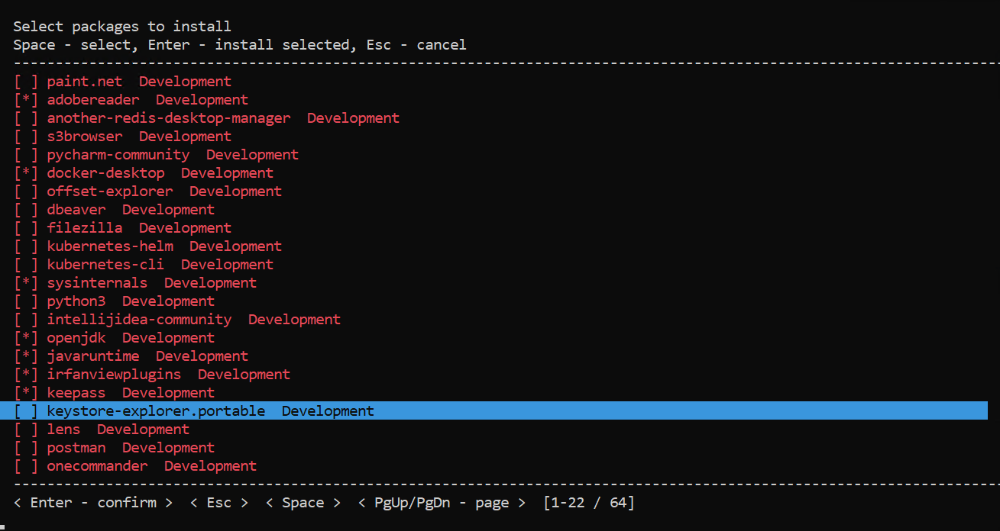
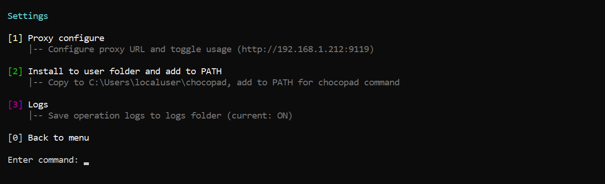

<p align="center">
  
  
  
</p>

<h1 align="center">🍫 CHOCOPAD</h1>
<p align="center">
  <strong>Terminal UI for Chocolatey</strong> — manage Windows packages without the command line
</p>
<p align="center">
  <em>For console lovers and automation enthusiasts</em>
</p>

<blockquote>
  🚀 <strong>Fresh machine or new workspace?</strong> Get all the software you need in minutes — no routine, no googling "how to install X".<br><br>
  Categories and package lists (Development, Local, VM) are my personal picks. Create your own: the menu and plain text files — it's all in your hands.
</blockquote>

<p align="center">
  <a href="#-screenshots">Screenshots</a> •
  <a href="#-features">Features</a> •
  <a href="#-installation">Installation</a> •
  <a href="#-running">Running</a> •
  <a href="#-menu">Menu</a> •
  <a href="#-configuration">Configuration</a>
</p>

---

## 📸 Screenshots

### Main menu

<p align="center"></p>

### Interactive package selection

<p align="center"></p>

### Settings

<p align="center"></p>

---

## ✨ Features

- **Interactive menu** — colorful TUI instead of typing commands
- **Install by category** — Development, Local, VM and custom categories
- **Checkbox selection** — Space to select, Enter to install
- **Bulk upgrade** — update all packages with one action
- **Proxy** — configure URL and toggle ON/OFF
- **Logging** — save operations to `logs/` folder
- **Install to PATH** — run `chocopad` from any directory

## 📦 Installation

### Requirements

- Windows 10/11 *(tested on both versions)*
- PowerShell 5.1+
- Administrator rights (for installing packages)

### Quick start

```powershell
# Clone the repository
git clone https://github.com/your-username/chocopad.git
cd chocopad

# Run chocopad.bat (will request administrator privileges)
.\chocopad.bat
```

Or directly via PowerShell:

```powershell
powershell -ExecutionPolicy Bypass -NoProfile -File ".\choco_software.ps1"
```

## 🚀 Running

| Method | Description |
|--------|-------------|
| **chocopad.bat** | Recommended. Automatically requests administrator privileges |
| **PowerShell** | `powershell -ExecutionPolicy Bypass -File choco_software.ps1` |

> ⚠️ Chocolatey requires administrator rights to install packages. The script will automatically restart with elevation when needed.

## 📋 Menu

| Key | Action |
|-----|--------|
| **C** | Install or upgrade Chocolatey |
| **U** | Upgrade all installed packages |
| **I** | Install packages by category (Development, Local, VM) |
| **S** | Show list of installed packages |
| **M** | Interactive selection — install/uninstall (checkbox menu) |
| **O** | Settings (proxy, PATH, logs) |
| **Q** | Exit |

### Interactive menu [M]

- **Space** — select/deselect package
- **Enter** — install selected (with confirmation)
- **Esc** — cancel
- **PgUp/PgDn** — page navigation

## ⚙️ Configuration

### Package categories

Files `packages_dev.txt`, `packages_local.txt`, `packages_vm.txt` — one package per line. Comments with `#`:

```
7zip.install
paint.net
# adobereader
python3
```

Categories can be added and edited via menu **[I]** → **[E]** (Manage categories).

### Config file

Settings are stored in `%APPDATA%\chocopad\settings.json`:

- `proxyUrl` — proxy URL
- `useProxy` — enable/disable proxy
- `logsEnabled` — enable/disable logging

### Logs

When enabled in settings, logs are saved to the `logs/` folder next to the script:

```
logs/chocopad_2025-03-02.log
```

### Install to PATH

**[O]** → **[2]** — copies chocopad to `%USERPROFILE%\chocopad` and adds to PATH. After that, the `chocopad` command is available from any terminal.

## 📁 Project structure

```
chocopad/
├── choco_software.ps1   # Main script
├── chocopad.bat         # Launcher with elevation
├── categories.json      # Package categories
├── packages_dev.txt     # Packages: Development
├── packages_local.txt   # Packages: Local
├── packages_vm.txt      # Packages: VM
├── docs/
│   └── images/          # Screenshots
└── README.md
```

## 📄 License

MIT

---

<p align="center">
  Made with 🍫 for Windows
</p>
